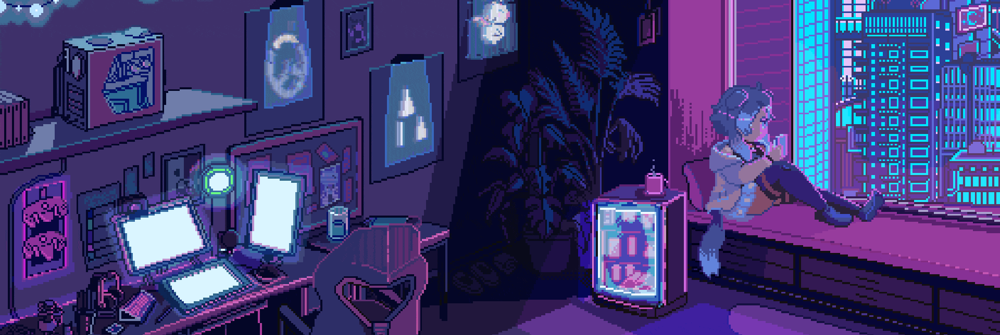

# Hi! 👋 I'm Ruvi 👩🏽‍💻

  

  

## 👩🏽 About Me

I'm a fullstack developer with a focus on frontend development. Passionate about creating impactful software.

- 🔭 I'm currently working at Intellogic
- 🌱 I'm constantly learning and exploring new technologies
- 👯 I'm looking to contribute on interesting open source projects

## 🛠️ Technologies & Tools

### Frontend Development

<table>
  <tr>
    <td align="center" width="96" height="96" style="position: relative;">
      
       React
    </td>
    <td align="center" width="96" height="96" style="position: relative;">
      
       Next.js
    </td>
    <td align="center" width="96" height="96" style="position: relative;">
      
       Vue.js
    </td>
    <td align="center" width="96" height="96" style="position: relative;">
      
       Tailwind
    </td>
    <td align="center" width="96" height="96" style="position: relative;">
      
       Typescript
    </td>
    <td align="center" width="96" height="96" style="position: relative;">
      
       SASS
    </td>
  </tr>
</table>

### Backend Development

<table>
  <tr>
    <td align="center" width="96" height="96">
      
       Node.js
    </td>
    <td align="center" width="96" height="96">
      
       Express.js
    </td>
    <td align="center" width="96" height="96">
      
       MongoDB
    </td>
    <td align="center" width="96" height="96">
      
       MySQL
    </td>
    <td align="center" width="96" height="96">
      
       PostgreSQL
    </td>
  </tr>
</table>

### Tools & Infrastructure

<table>
  <tr>
    <td align="center" width="96" height="96">
      
       Docker
    </td>
    <td align="center" width="96" height="96">
      
       AWS
    </td>
    <td align="center" width="96" height="96">
      
       GCloud
    </td>
    <td align="center" width="96" height="96">
      
       GitHub
    </td>
    <td align="center" width="96" height="96">
      
       Git
    </td>
    <td align="center" width="96" height="96">
      
       Postman
    </td>
  </tr>
</table>

## 💬 Socials

<table>
  <tr>
    <td align="center" width="96" height="96">
      
       LinkedIn
    </td>
    <td align="center" width="96" height="96">
      
       Email
    </td>
    <td align="center" width="96" height="96">
      
       Medium
    </td>
  </tr>
</table>
